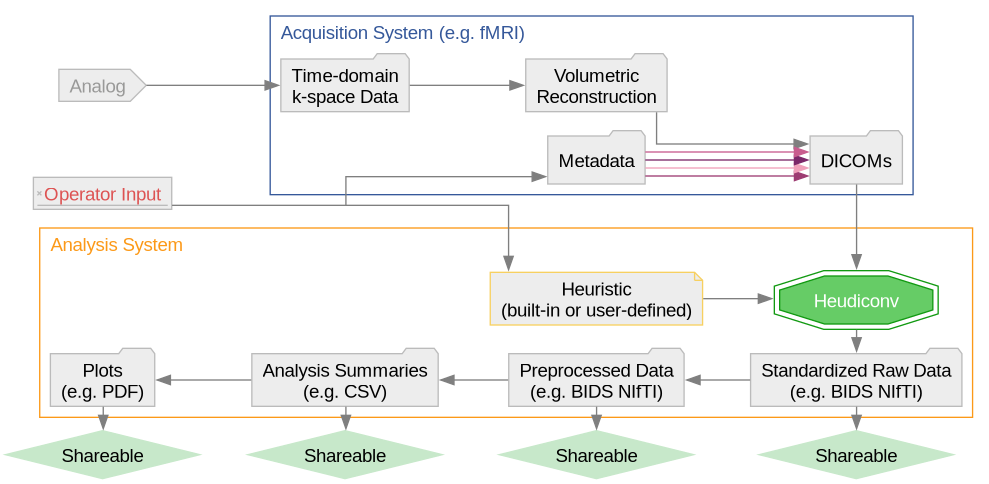
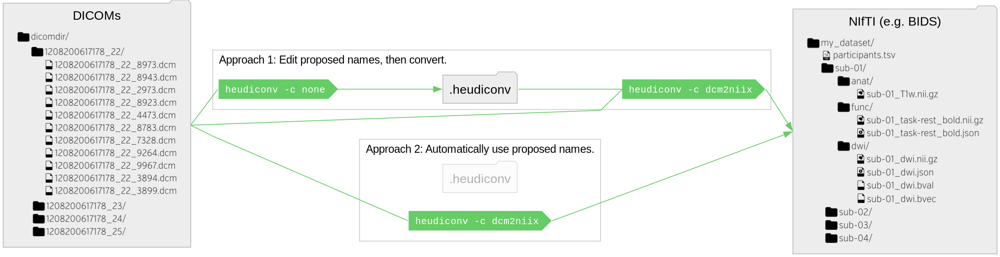

=============
**HeuDiConv**
=============

`a heuristic-centric DICOM converter`

This is a fork, only hosted privately so we can do our Virdx conda packaging.

About
-----

``heudiconv`` is a flexible DICOM converter for organizing imaging data
into structured directory layouts.

- It allows flexible directory layouts and naming schemes through customizable heuristics implementations.
- It only converts the necessary DICOMs and ignores everything else in a directory.
- You can keep links to DICOM files in the participant layout.
- Using `dcm2niix <https://github.com/rordenlab/dcm2niix/>`_ under the hood, it's fast.
- It can track the provenance of the conversion from DICOM to NIfTI in W3C PROV format.
- It provides assistance in converting to `BIDS <http://bids.neuroimaging.io/>`_.
- It integrates with `DataLad <https://www.datalad.org/>`_ to place converted and original data under git/git-annex
version control while automatically annotating files with sensitive information (e.g., non-defaced anatomicals, etc).

Heudiconv can be inserted into your workflow to provide automatic conversion as part of a data acquisition pipeline, as seen in the figure below:

Installation
------------

This fork is a dependency for `vxconvert`. It could, but it's not meant to be used as a standalone. For that, check the upstream `installation page <https://heudiconv.readthedocs.io/en/latest/installation.html>`_
on heudiconv.readthedocs.io .

HOWTO 101
---------

In a nutshell -- ``heudiconv`` is given a file tree of DICOMs, and it produces a restructured file tree of NifTI files (conversion handled by `dcm2niix`_) with accompanying metadata files.
The input and output structure is as flexible as your data, which is accomplished by using a Python file called a ``heuristic`` that knows how to read your input structure and decides how to name the resultant files.
You can run your conversion automatically (which will produce a ``.heudiconv`` directory storing the used parameters), or generate the default parameters, edit them to customize file naming, and continue conversion via an additional invocation of `heudiconv`:

``heudiconv`` comes with `existing heuristics <https://github.com/nipy/heudiconv/tree/master/heudiconv/heuristics>`_ which can be used as is, or as examples.
For instance, the Heuristic `convertall <https://github.com/nipy/heudiconv/blob/master/heudiconv/heuristics/convertall.py>`_ extracts standard metadata from all matching DICOMs.
``heudiconv`` creates mapping files, ``<something>.edit.text`` which lets researchers simply establish their own conversion mapping.

In most use-cases of retrospective study data conversion, you would need to create your custom heuristic following the examples and the `"Heuristic" section <https://heudiconv.readthedocs.io/en/latest/heuristics.html>`_ in the documentation.
**Note** that `ReproIn heuristic <https://github.com/nipy/heudiconv/blob/master/heudiconv/heuristics/reproin.py>`_ is
generic and powerful enough to be adopted virtually for *any* study: For prospective studies, you would just need
to name your sequences following the `ReproIn convention <https://github.com/nipy/heudiconv/blob/master/heudiconv/heuristics/reproin.py#L26>`_, and for
retrospective conversions, you often would be able to create a new versatile heuristic by simply providing
remappings into ReproIn as shown in `this issue (documentation is coming) <https://github.com/ReproNim/reproin/issues/18#issuecomment-834598084>`_.

Having decided on a heuristic, you could use the command line::

    heudiconv -f HEURISTIC-FILE-OR-NAME -o OUTPUT-PATH --files INPUT-PATHs

with various additional options (see ``heudiconv --help`` or
`"CLI Reference" in documentation <https://heudiconv.readthedocs.io/en/latest/commandline.html>`__) to tune its behavior to
convert your data.

For detailed examples and guides, please check out `ReproIn conversion invocation examples <https://github.com/ReproNim/reproin/#conversion>`_
and the `user tutorials <https://heudiconv.readthedocs.io/en/latest/tutorials.html>`_ in the documentation.

How to cite
-----------

Please use `Zenodo record <https://doi.org/10.5281/zenodo.1012598>`_ for
your specific version of HeuDiConv.  We also support gathering
all relevant citations via `DueCredit <http://duecredit.org>`_.

How to contribute
-----------------

For a detailed into, see our `contributing guide <CONTRIBUTING.rst>`_.

Our releases are packaged using Intuit auto, with the corresponding workflow including
Docker image preparation being found in ``.github/workflows/release.yml``.

3-rd party heuristics
---------------------

- https://github.com/courtois-neuromod/ds_prep/blob/main/mri/convert/heuristics_unf.py

Support
-------

All bugs, concerns and enhancement requests for this software can be submitted here:
https://github.com/nipy/heudiconv/issues.

If you have a problem or would like to ask a question about how to use ``heudiconv``,
please submit a question to `NeuroStars.org <http://neurostars.org/tags/heudiconv>`_ with a ``heudiconv`` tag.
NeuroStars.org is a platform similar to StackOverflow but dedicated to neuroinformatics.

All previous ``heudiconv`` questions are available here:
http://neurostars.org/tags/heudiconv/ .
